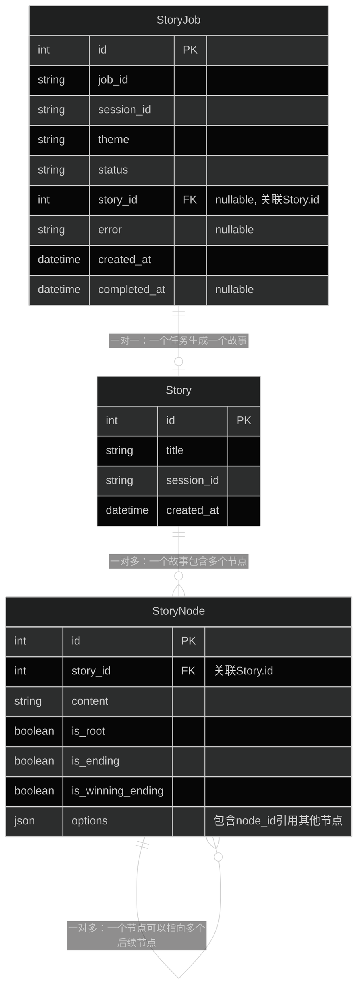
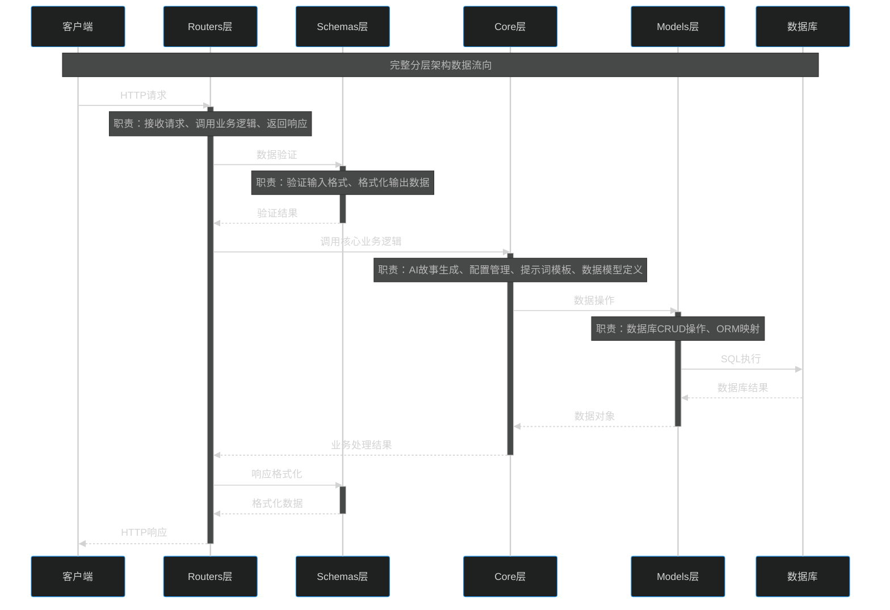
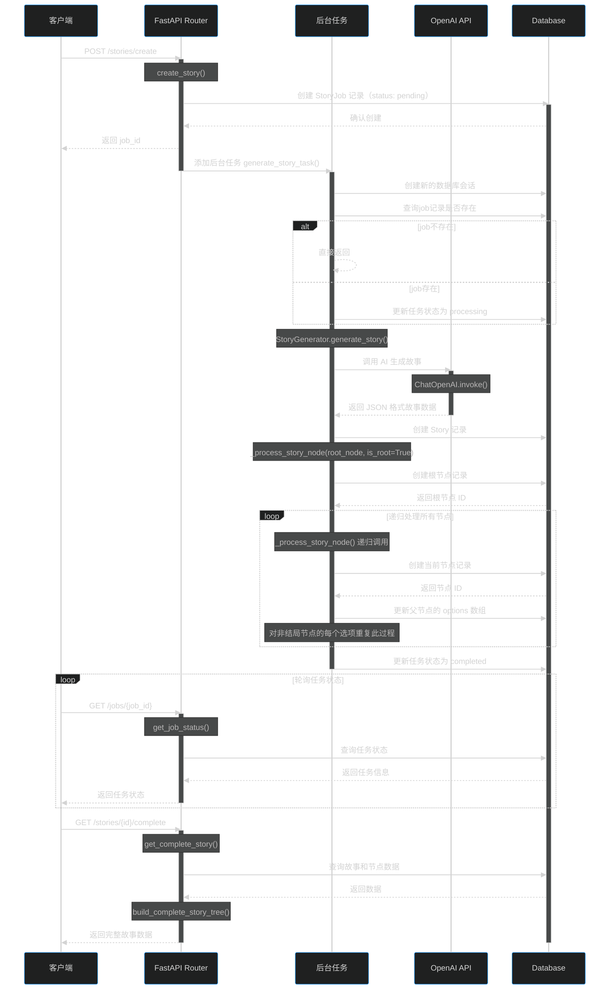
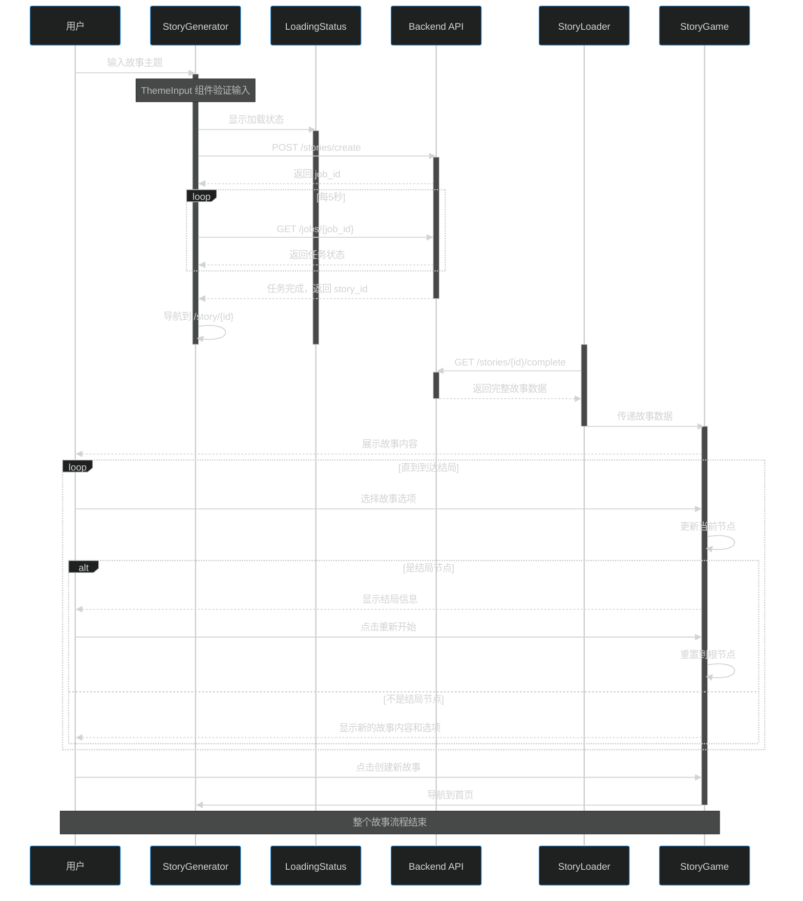

# FastAPI+React+OpenAI API 全栈开发

✅ FastAPI  
✅ SQLAlchemy  
✅ React + Vite  
✅ LangChain + OpenAI  
⚠️ SQLite  
⚠️ 原生CSS  

本项目使用 FastAPI + React 实现了一个 AI 生成的文字冒险游戏。根据 [The Ultimate FastAPI + React Full Stack Project](https://www.youtube.com/watch?v=_1P0Uqk50Ps&list=LL&index=1&t=71s) 视频教程实现，原项目 github 地址为[Choose-Your-Own-Adventure-AI](https://github.com/techwithtim/Choose-Your-Own-Adventure-AI)，适合有一定 Python 和 JS 基础的开发者学习 FastAPI 和 React 全栈开发。  

与原项目不同的地方：  
1.对后端进行了重构，新增了 story_server.py 处理故事生成的业务逻辑、数据库操作和错误处理，使每个模块的职责更清晰。  
2.对提示词进行一定优化，使生成的故事与选项内容更加匹配。  
3.本地化

## 最终运行效果


## backend 搭建

### 安装环境

#### 1. uv 安装

官方手册 [Installing uv](https://docs.astral.sh/uv/getting-started/installation/)  
我选择的安装方式是

    cd backend
    pip install uv

安装完成后输入

    uv init .
uv init . 会生成 pyproject.toml 和 .python-version 配置文件，可以在文件里修改要安装的 python 版本。__使用 FastAPI 你的 Python 版本必须  >3.6 ， 我使用的版本为 3.12。__  


#### 2.安装依赖  

    uv add fastapi[all] langchain langchain-openai python-dotenv sqlalchemy uvicorn psycopg2-binary
这样做的主要目的是将这些依赖项保持为项目私有，与系统其他部分隔离。  

如果出现以下警告，会影响uv性能但不会影响项目运行。  

    warning: Failed to hardlink files; falling back to full copy. This may lead to degraded performance.
    If the cache and target directories are on different filesystems, hardlinking may not be supported.
    If this is intentional, set export UV_LINK_MODE=copy or use --link-mode=copy to suppress this warning.
可参考本帖 <https://github.com/astral-sh/uv/issues/7285>

如果下载速度比较慢可以配置国内源，在 pyproject.toml 中输入

    [[index]]
    url = "https://pypi.mirrors.ustc.edu.cn/simple/"
    default = true
如需使用其他镜像源也可自行选择。

安装完成后设置编辑器环境，位置在

    .\.venv\Scripts\python.exe  

### backend 文件结构搭建  

```text
backend/
├─ __init__.py                   # Python包标识文件
├─ .env                          # 环境变量配置文件
├─ .python-version               
├─ main.py                       # 应用程序启动入口，配置所有中间件和路由
├─ pyproject.toml
├─ uv.lock
├─ .venv
├─ core/
│  ├─ __init__.py                
│  ├─ config.py                  # 集中管理所有环境变量和应用配置
│  ├─ models.py                  # 定义AI返回数据的结构化模型，确保数据格式正确
│  ├─ prompts.py                 # 提供标准化的提示词模板
│  ├─ story_generator.py         # 实现AI故事生成的核心算法，专注于AI模型调用
│  └─ story_service.py           # 故事业务服务层，处理数据库操作和业务逻辑编排
├─ db/
│  ├─ __init__.py                
│  └─ database.py                # 管理数据库连接、会话和表结构创建
├─ models/
│  ├─ __init__.py               
│  ├─ job.py                     # 跟踪异步任务的执行状态和结果
│  └─ story.py                   # 定义故事和节点的数据库表结构，实现树状关系存储
├─ routers/
│  ├─ __init__.py                
│  ├─ job.py                     # 提供任务状态查询接口，支持异步处理模式
│  └─ story.py                   # 提供故事创建和获取的REST API接口
└─ schemas/
   ├─ __init__.py                
   ├─ job.py                     # 标准化任务相关API的数据格式
   └─ story.py                   # 定义API的输入输出数据格式
```

### 检查运行

在终端 cd 到 backend ，并运行

    uv run .\main.py

在浏览器输入对应地址可以看到 FastAPI 自动生成的 API 文档界面。  

    http://localhost:8000/docs
    http://localhost:8000/redoc

## backend项目结构

*⚠️以下图均由AI生成*

### 数据表结构



### backend分层架构结构图



### backend 时序图



## frontend 搭建

### 安装环境

`安装前需要确保你的环境中已安装 Node.js`

终端 cd 到项目 __根目录__

#### 1. 使用 Vite 创建 React 项目

    npm create vite@latest frontend -- --template react

cd 到 __frontend__

#### 2. 安装 package.json 中定义的所有依赖

    npm install

#### 3. 安装 axios HTTP 客户端库

    npm install axios

#### 4. 安装 dom 库，这个库用于实现不同页面的路由跳转

    npm install react-router-dom

#### 5. 运行

    npm run dev

### frontend 文件结构

```
frontend/
├─ eslint.config.js           
├─ index.html                           # 应用入口 HTML 文件
├─ package.json               
├─ vite.config.js             
└─ src/
   ├─ App.css                           # 全局样式表
   ├─ App.jsx                           # React 应用主组件
   ├─ index.css                         # 入口样式表，通常用于全局样式
   ├─ main.jsx                          # 应用入口文件，挂载 React 组件
   ├─ util.js                           # 工具函数文件
   └─ components/
      ├─ LoadingStatus.jsx              # 显示加载状态组件
      ├─ StoryGame.jsx                  # 主界面组件
      ├─ StoryGenerator.jsx             # 故事生成器组件
      ├─ StoryLoader.jsx                # 故事加载组件
      └─ ThemeInput.jsx                 # 主题输入组件
```

### frontend 时序图

*⚠️下图由AI生成*




